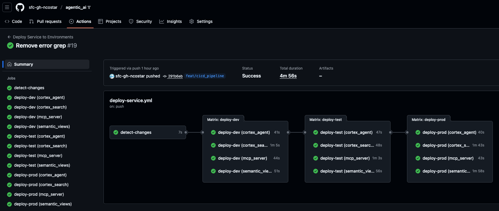

# TechUp25 Agentic AI and Production Deployment Patterns 🤖

[](https://github.com/sfc-gh-ncostar/agentic_ai/actions/workflows/deploy-service.yml)

## Overview

This project provisions a Snowflake environment named `TECHUP25` and sets up a "Snowflake Housekeeping" experience that lets you explore and analyze account query history using Snowflake Cortex. The script:

- Creates and grants a consumer role `TECHUP25_RL`
- Creates database/schema and a warehouse `TECHUP25_wh`
- Materializes recent `ACCOUNT_USAGE.QUERY_HISTORY` into `TECHUP25.AGENTIC_AI.QUERY_HISTORY_MATERIALIZED`
- For each environment (DEV, TEST, PROD), it:
  - Builds a Cortex Search Service `TECHUP25.AGENTIC_AI.{{ENV}}QUERY_HISTORY_SEARCH_SERVICE` over the materialized history
  - Creates a Cortex Semantic Model `TECHUP25.AGENTIC_AI.{{ENV}}SNOWFLAKE_HOUSEKEEPING_AGENT`
  - Creates a Cortex Agent `TECHUP25.AGENTIC_AI.SNOWFLAKE_HOUSEKEEPING_AGENT`
  - Creates a local MCP server `SNOWFLAKE_HOUSEKEEPING_MCP_SERVER` so tools (like Cursor) can query the search service and semantic model via MCP

Initial setup (roles, database, schema, warehouse) is orchestrated by the `setup.sql` script. Deployment of resources through schemas is orchestrated by the GitHub Actions workflow.



## Lab Setup

### Prerequisites

- A Snowflake account with ability to assume `ACCOUNTADMIN` during setup
- Snowsight or `snowsql` to run SQL
- A Programmatic Access Token (PAT) tied to role `TECHUP25_RL` for MCP access
- [Optional] A GitHub account and another Snowflake PAT token to deploy the service to the different environments (DEV, TEST, PROD)

## Step-by-step

### 1) Run the setup script

Run `setup.sql` in a Snowflake worksheet or via `snowsql`.

- Enables cross-region inference (for models such as `claude-4-sonnet`):
  - `ALTER ACCOUNT SET CORTEX_ENABLED_CROSS_REGION = 'AWS_US';`
- Creates role and grants:
  - `TECHUP25_RL`, `SNOWFLAKE.CORTEX_USER`, `SNOWFLAKE.GOVERNANCE_VIEWER`
  - Grants usage and object privileges on `TECHUP25` and `TECHUP25.AGENTIC_AI`
- Creates compute:
  - Warehouse: `TECHUP25_wh` (SMALL, auto-resume, 1-hour auto-suspend)
- Creates and populates data:
  - `TECHUP25.AGENTIC_AI.QUERY_HISTORY_MATERIALIZED` from `SNOWFLAKE.ACCOUNT_USAGE.QUERY_HISTORY`
  - Populates the last 14 days with derived search fields and categories
- Creates Cortex Search Service:
  - `TECHUP25.AGENTIC_AI.QUERY_HISTORY_SEARCH_SERVICE` (warehouse `TECHUP25_wh`, `TARGET_LAG = '1 HOUR'`)
- Creates the semantic view:
  - `TECHUP25.AGENTIC_AI.SNOWFLAKE_HOUSEKEEPING_AGENT` from an inline definition
- Creates the Cortex Agent:
  - `TECHUP25.AGENTIC_AI.SNOWFLAKE_HOUSEKEEPING_AGENT` with tools: Cortex Search and Cortex Analyst (text-to-sql) over the staged semantic model
- Creates the MCP Server and grants usage:
  - `SNOWFLAKE_HOUSEKEEPING_MCP_SERVER` and `GRANT USAGE` to `TECHUP25_RL`
- ‼️ Important, the last command in the script will create a PAT token for use later. Please store this somewhere securely and locally for future use. If you lose it, you will need to create a new one.

Tip: If you want to use existing database/schema/warehouse names, adjust them in `setup.sql` before running (not recommended).

### 2) Configure Cursor MCP client

Add the following entry to your local `.cursor/mcp.json` so Cursor can call Snowflake MCP endpoints with your PAT. This is the PAT token created in the setup script.

```json
{
  "Snowflake_TECHUP25": {
    "url": "https://<org>.<account>.snowflakecomputing.com/api/v2/databases/TECHUP25/schemas/AGENTIC_AI/mcp-servers/SNOWFLAKE_HOUSEKEEPING_MCP_SERVER",
    "headers": {
      "Authorization": "Bearer <YOUR_PAT_TOKEN>"
    }
  }
}
```

Replace `<org>.<account>` and `<YOUR_PAT_TOKEN>` accordingly.

## Verify your setup

Run these checks after executing `setup.sql`.

### Check materialized query history

```sql
USE ROLE TECHUP25_RL;
USE DATABASE TECHUP25;
USE SCHEMA AGENTIC_AI;
SELECT COUNT(*) AS total_queries FROM QUERY_HISTORY_MATERIALIZED;
SELECT MIN(START_TIME) AS earliest_query, MAX(START_TIME) AS latest_query FROM QUERY_HISTORY_MATERIALIZED;
```

### Test Cortex Search Service

Wait 1–2 minutes after creation for indexing to complete, then run:

```sql
SELECT SNOWFLAKE.CORTEX.SEARCH_PREVIEW(
  'TECHUP25.AGENTIC_AI.QUERY_HISTORY_SEARCH_SERVICE',
  '{
    "query": "expensive long running high cost query optimization",
    "columns": ["QUERY_ID", "USER_NAME", "COST_CATEGORY", "PERFORMANCE_CATEGORY", "QUERY_SUMMARY"],
    "limit": 3
  }'
);
```

### Explore key fields

```sql
SELECT
  QUERY_ID, QUERY_TYPE, USER_NAME, DATABASE_NAME,
  PERFORMANCE_CATEGORY, COST_CATEGORY,
  LEFT(SEARCH_METADATA, 100) AS search_metadata_preview,
  LEFT(QUERY_SUMMARY, 150) AS query_summary_preview,
  START_TIME
FROM QUERY_HISTORY_MATERIALIZED
ORDER BY START_TIME DESC
LIMIT 5;
```

## Notes

- Cross-region inference is enabled to allow models like `claude-4-sonnet`:
  - `ALTER ACCOUNT SET CORTEX_ENABLED_CROSS_REGION = 'AWS_US';`
- Grants are applied so `TECHUP25_RL` can use the warehouse, search service, stage, agent, and MCP server.
- If you change object names, update the MCP server `url` accordingly.

## Repository contents

- `setup.sql`: End-to-end provisioning (roles, DB/SC, WH, materialization, search service, stage, agent, MCP server)
- `README.md`: This guide

## Optional: Deploy to different environments

The repository includes a GitHub Actions workflow that can deploy the service to the different environments (DEV, TEST, PROD). To use it, you need to:

1. Create (or reuse from the setup script) a PAT token for the different environments and store it in the GitHub repository secrets.
1. Clone this repository to your own Github account.
1. Go to your repository settings and create the following secrets:
   - `SNOWFLAKE_ACCOUNT`: Your Snowflake account ID
   - `SNOWFLAKE_USER`: Your Snowflake user (e.g. `GH_ACTION_USER`)
   - `SNOWFLAKE_PASSWORD`: Your Snowflake user's PAT token
1. Make changes to the service definitions in the `components` folder.
1. Push your changes to the repository.
1. The workflow will deploy the service to the different environments (DEV, TEST, PROD).